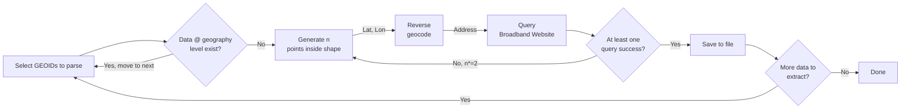

## 🥟 Appetizer  
We needed to extract broadband coverage data for counties surrounding the capitals of **Alabama and Georgia**, but the source website aggressively blocked IP addresses after detecting high traffic. This made large-scale data scraping nearly impossible through conventional means.

## 🍲 Main Dish  
To sidestep the IP throttling issue, we developed a novel scraping workflow that avoids hitting the same endpoints repeatedly:

- Rather than pulling bulk datasets directly, we **reverse-geocoded incrementally spaced latitude-longitude coordinates** and delayed sampling to retrieve addresses block-by-block.
- This allowed us to systematically gather coverage data at the **block group level** without tripping anti-bot protections.

- We tested multiple VPN approaches, and found that **IP rotation tools like Surfshark’s** were not reliable overnight—often stalling or failing to refresh, making them unsuitable for unattended scraping.
- A tailored approach for simulating human browsing behavior—combined with measured pacing—enabled us to collect data from the website in a respectful and non-intrusive manner.

## 🍵 Aftertaste  
The final workflow allowed us to successfully extract **100% block-group level coverage** for the targeted regions:

    

## 🍽️ Final Byte  
When brute force breaks down, precision wins. In scraping, as in design, knowing *where* to poke often matters more than how hard you push. Sometimes, the cleverest path is the one that mimics how humans would look things up—just with a lot more patience.